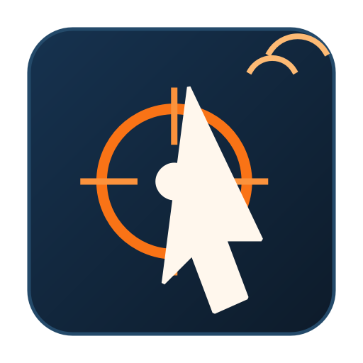

<p align="center">
  
</p>

<h1 align="center">专业连点器 Pro</h1>

<p align="center">
  一个专注、轻量、适合 Windows 的鼠标与键盘自动连发工具。
</p>

<p align="center">
  <a href="./README.md">English</a> |
  <a href="./README.zh-CN.md">简体中文</a> |
  <a href="./README.zh-TW.md">繁體中文</a>
</p>

<p align="center">
  
  
  
  
</p>

## 项目简介

专业连点器 Pro 基于 Python 和 PySide6 构建，面向 Windows 桌面场景，适合处理日常重复点击、按键连发和轻量自动化操作。项目的目标不是堆叠复杂功能，而是在常见使用场景下提供更直接、更稳定的操作体验。

现在项目已经支持完整的简体中文、繁体中文和 English 多语言界面，并且会记住你上次真正使用的配置，包括动作模式和界面语言，重新打开即可继续上次的工作状态。

## 主要特性

- 鼠标模式支持左键、右键、中键连点
- 鼠标目标支持“启动后延时记录当前位置”和“固定坐标”两种方式
- 键盘模式支持单键和组合键连发
- 会根据当前模式自动隐藏不相关参数，界面更干净
- 会自动恢复上次使用的实际配置和语言
- 支持全局热键与仅应用内热键
- 支持预设保存，以及 JSON 导入导出
- 支持系统托盘运行

## 环境要求

- Windows
- Python 3.14 或更高版本

## 快速开始

安装依赖：

```powershell
python -m pip install -r requirements.txt
```

启动开发版：

```powershell
python auto_clicker.py
```

## 本地打包

```powershell
.\build.ps1
```

打包完成后，可执行文件位于 `dist/ProAutoClicker/ProAutoClicker.exe`。

## 发布流程

仓库已经包含 `.github/workflows/build-release.yml`。

- 推送到 `main` 分支时会自动构建 Windows Artifact
- 推送 `v1.0.0` 这类标签时会自动构建并创建 GitHub Release
- 也支持手动触发 `workflow_dispatch`

维护者发布步骤可参考 [RELEASING.md](./RELEASING.md)。

## 多语言支持

- 应用内支持：`简体中文`、`繁體中文`、`English`
- 当前语言会写入 `settings.json`
- 校验错误、托盘菜单、帮助说明、运行状态文案都会随界面语言一起切换

## 项目结构

```text
auto_clicker.py
autoclicker/
  app.py
  controller.py
  i18n.py
  keymaps.py
  models.py
  resources.py
  store.py
  win32_backend.py
  ui/
    hotkey_edit.py
    main_window.py
assets/
scripts/
tests/
.github/workflows/
build.ps1
ProAutoClicker.spec
```

## 许可证

本项目使用 [MIT License](./LICENSE)。
